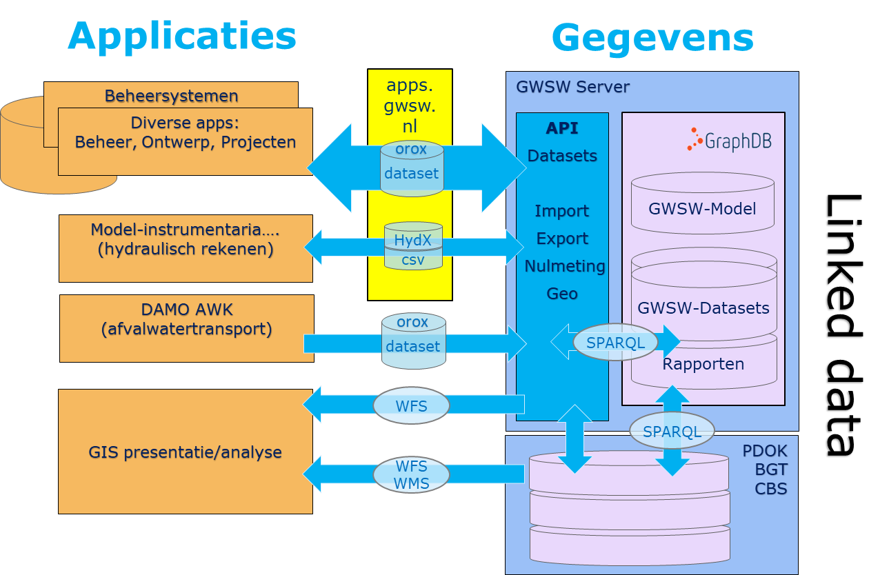
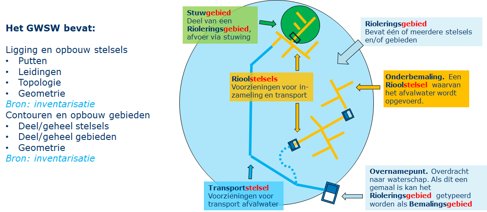
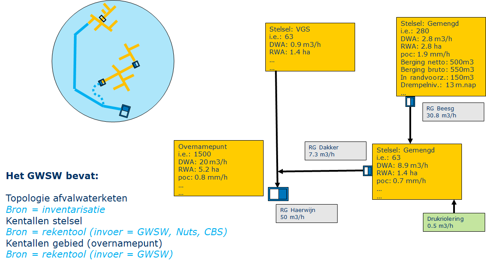
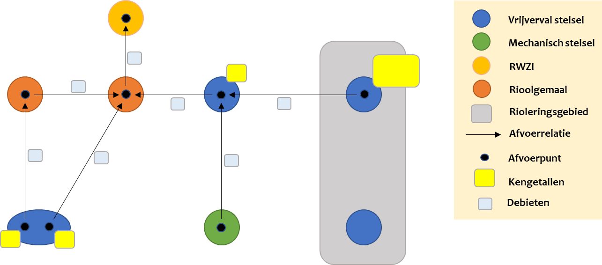
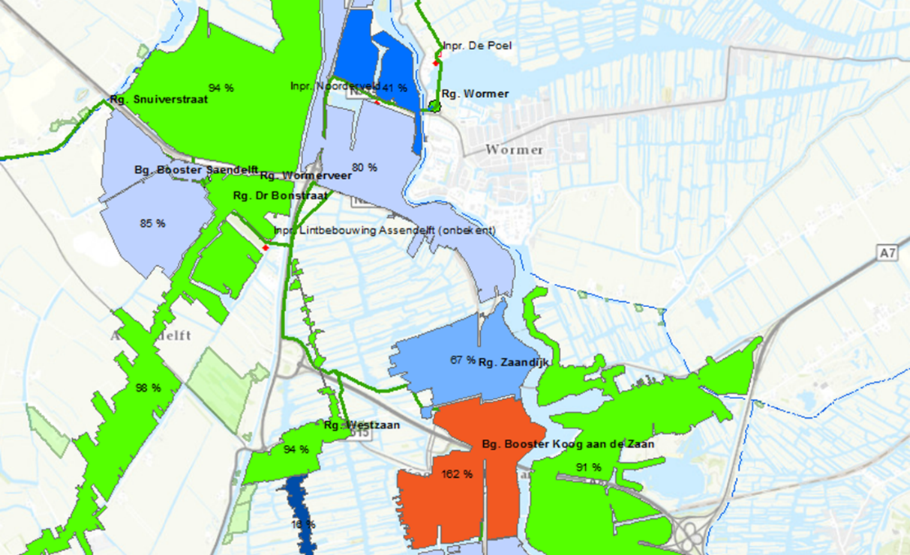

# GWSW Kentallen

**Beschrijving van afvoerrelaties en gebiedskenmerken per rioleringsgebied**

Versie 0.1.3

Versietabel

- Versie 0.1.2 tweede opzet, harmoniseren met GWSW model
- Versie 0.1.1 eerste opzet van GWSW Kentallen + uitkomsten overleg MV en JN
- Versie 0.1 eerste opzet van GWSW Kentallen

# Inleiding

Afvoerrelaties en kentallen van rioolstelsels en rioleringsgebieden worden onder andere gebruikt voor het opstellen van afvalwaterprognoses. Om deze informatie bij elkaar te krijgen, is vaak een forse inspanning nodig. Door gebruik te maken van gestandaardiseerde open data en eenduidige terminologie is het mogelijk om op een efficiënte en vergelijkbare wijze de afvoerrelaties en gebiedskenmerken te beschrijven. Dit vereenvoudigt en verbetert het opstellen van afvalwaterprognoses.

De afkorting GWSW staat voor *GegevensWoordenboek Stedelijk Water*, de open standaard waaraan Stichting RIONED met alle relevante partijen werkt. Daarmee worden komende jaren alle objecten en de gegevens van die objecten, hun onderlinge relaties, en de beheeractiviteiten aan de riolering eenduidig gedefinieerd en vastgelegd ten behoeve van soepele gegevensuitwisseling en beter beheer. Meer informatie daarover vindt u via [www.riool.net/gwsw](https://www.riool.net/gwsw).

Een deel van deze afvoerrelaties en kentallen kunnen reeds worden beschreven met het GWSW. In het GWSW ontbreekt echter de schematisering van onderling aansluitende rioleringsgebieden en de verbinding met de RWZI. Vanuit de Community of Practice ‘Afvalwaterprognoses’ van de waterschappen is aan Stichting RIONED gevraagd om het GWSW geschikt te maken om als bron te dienen voor het doorrekenen van afvoerscenario’s in de afvalwaterketen. Dit wordt beschreven in GWSW-Kentallen.

De beschrijving van het GWSW model vindt u op [data.gwsw.nl](https://data.gwsw.nl/) . De datamodellen GWSW-Basis (operationeel beheer), GWSW-Rib (inspectie en reiniging van leidingen, putten en kolken) en GWSW-Hyd (hydraulische modellering) zijn al eerder vastgestelde onderdelen van het GWSW. De tools rondom GWSW vindt u op [apps.gwsw.nl](https://apps.gwsw.nl) .

# Het GWSW en afvalwaterprognoses

## GWSW Architectuur

In de volgende figuur zijn de bestaande gegevensstromen en gereedschappen rond het GWSW weergegeven, die zijn in veel gevallen ook relevant voor het doorrekenen van afvoerscenario’s.

*GWSW Architectuur*

**Gegevens** worden uitgewisseld met het GWSW-OroX, een uitwisselprotocol volgens de wereldwijd toegepaste linked data taal RDF/RDFS/OWL-2/Turtle. Het GWSW.orox is de uitwisselingsvorm voor alle disciplines zoals aanleg, vervangen, inspecties en dus ook hydraulische berekeningen. Een GWSW.orox bestand wordt vanuit de beheersystemen aangemaakt en zal alle relevante projectgegevens bevatten, bij hydraulische berekeningen dus de relevante gegevens uit het studiegebied. Het GWSW.orox bestand kan door beheersystemen en andere software weer ingelezen worden en op die manier de resultaten van uitgevoerde inspecties of berekeningen terugvoeren.

De volgende **gereedschappen** spelen een rol:

1. Beheersystemen: Deze applicaties hebben import- en exportfuncties voor de uitwisseling van de projectgegevens conform OroX.
2. GWSW-Server: Deze applicatieserver (in beheer bij Stichting RIONED) verzorgt de import van GWSW.orox bestanden en plaatst die in zogenaamde GWSW-datasets. De GWSW-datasets dienen als neutrale gegevensbron voor allerlei toepassingen. De GWSW-server verzorgt dan ook de export en import van hydx-bestanden voor hydraulische berekeningen met als basis de GWSW-datasets. Daarnaast valideert de GWSW-server zowel de aangeleverde projectgegevens als de terug geleverde projectresultaten. Deze validatie borgt de basiskwaliteit van de datasets. De validatie is een nulmeting waarbij alleen op de in het GWSW opgenomen kwaliteitseisen (zoals objecttypering, minimum en maximum waarde, verplichte kenmerken) getoetst wordt.
3. Modelinstrumentaria: Deze applicaties hebben een import- en exportfunctie voor de uitwisseling van de kenmerken van een rioolstelsel die relevant zijn voor de uit te voeren of uitgevoerde hydraulische berekeningen. De applicaties maken gebruik van het hiervoor speciaal ontwikkelde HydX-formaat, of de algemene OroX import- en exportfuncties.

## Proces afvalwaterprognoses

Zoals beschreven heeft het GWSW als doel de gegevens voor stedelijk waterbeheer optimaal te laten doorstromen. Nu al worden de rioolstelsels en afvoersystemen van gemeenten en waterschappen op de GWSW Server gepubliceerd. De rioleringsbeheersystemen van gemeenten en de DAMO-AWK database van waterschappen zijn daarvoor een belangrijke bron.

Belangrijke GWSW concepten voor het uitwerken van afvoerscenario's en het maken van afvalwaterprognoses zijn *Stelsel* en *Gebied*

*Stelsels en gebieden in het GWSW*  

Het datamodel GWSW Kentallen ondersteunt bij het doorrekenen van afvoerscenario's. Dat geeft inzicht in de belasting van de zuiveringsinstallatie, belangrijk voor het optimaliseren van de afvalwaterketen.

Waterschappen en adviesbureaus hebben diverse applicaties in gebruik voor het doorrekenen van afvoerscenario's. In alle gevallen wordt er een schematisatie van de afvalwaterstromen afvoeren binnen de zuiveringskring uitgewerkt en doorgerekend.

*Voorbeeld blokkenschema zuiveringskring*  

## Reikwijdte GWSW Kentallen

Het datamodel GWSW Kentallen bevat alle modelgegevens die noodzakelijk zijn voor het berekenen van afvoerscenario's binnen de afvalwaterketen. Belangrijke onderdelen van GWSW Kentallen zijn:

- De definitie van het rioleringsnetwerk conform de module GWSW Hyd, gebruikt voor netwerkberekeningen van vrijverval rioolstelsels. (al opgenomen in het GWSW)
- De definitie van het afvoernetwerk, de schematisering van onderling aansluitende rioleringsgebieden en de verbinding met de RWZI. (nieuw in het GWSW)
- Een - vooralsnog beperkte - beschrijving van de gemeentelijke en waterschaps-activiteiten voor het optimaliseren van de afvalwaterketen (al eerder - in concept- opgenomen in het GWSW)

# Datamodel GWSW Kentallen

## Afvoernetwerk

Zie [data.gwsw.nl/Kentallen/Afvoernetwerk](https://data.gwsw.nl/Kentallen/Afvoernetwerk)

Binnen een zuiveringskring vormen rioleringsgebieden, rioolstelsels (vrijverval en mechanisch), rioolgemalen en de zuivering een afvoernetwerk. Dit netwerk bestaat uit verbindingen (afvoerrelaties) en knooppunten (afvoerpunten). Dit netwerk en bijbehorende relevante kenmerken worden beschreven in GWSW Kentallen.

*Afvoernetwerk in GWSW Kentallen*

## Afvoerrelatie

Zie [data.gwsw.nl/Kentallen/Afvoerrelatie](https://data.gwsw.nl/Kentallen/Afvoerrelatie)

### Identiteit

De verbinding tussen het ene knooppunt en het andere knooppunt wordt afvoerrelatie genoemd. Elke afvoerrelatie is van het type gwsw:Afvoerrelatie, een subtype van gwsw:Verbinding. Een afvoerrelatie kan een naam hebben (geldt voor elk object in het GWSW).

### Van en naar

In de afvoerrelatie staat gedefinieerd van welk knooppunt naar welk knooppunt de afvoer plaatsvindt. Die knooppunten zijn altijd van het type gwsw:Afvoerpunt (een subtype van gwsw:Knooppunt).

Subtypes van gwsw:Afvoerrelatie definiëren op welke wijze de afvoer plaatsvindt, via een vrijverval transportleiding of (meestal) via een persleiding zijn.

### Debiet

Bij de afvoerrelatie wordt ook gedefinieerd wat het afvoerdebiet is bij droogweersituaties (DWA) en bij regenwaterafvoersituaties (DWA+RWA).

## Afvoerpunt  

Zie [data.gwsw.nl/Kentallen/Afvoerpunt](https://data.gwsw.nl/Kentallen/Afvoerpunt)

De afvoerrelaties zijn onderling verbonden door afvoerpunten. Het GWSW model is zo ingericht dat het afvoerpunt is gerelateerd aan een fysieke afvoerconstructie (rioolgemaal, stuwput, leiding) binnen het aangesloten stelsel of gebied.

De kentallen (van het bijbehorende stelsel of gebied) worden geregistreerd bij het afvoerpunt. Dat biedt de mogelijkheid om meerdere afvoerpunten bij een stelsel (met bijvoorbeeld twee rioolgemalen) te beschrijven met bijbehorende kentallen of juist meerdere stelsels in een rioleringsgebied te clusteren en via één afvoerpunt te koppelen.

Een afvoerpunt is topologisch gekoppeld (met de relatie gwsw:hasConnection) aan een gwsw:Leiding (het begin- of eindpunt) of een gwsw:Doorlaat, gwsw:Pomp of gwsw:Wand (het begin- of eindpunt).
Daarnaast wordt een afvoerpunt toegekend (met de relatie gwsw:isPartOf) aan een gwsw:Stelsel (vrijverval of mechanisch), een gwsw:Gebied (dat meerdere stelsels kan bevatten) of een gwsw:Rioolgemaal.

Een afvoerpunt bij een rioolgemaal zal alleen gebruikt worden om een doorvoergemaal te beschrijven, in de meeste gevallen zal een rioolgemaal het afvoerpunt van een stelsel of gebied zijn.

## Vrijverval rioolstelsel

 Zie [data.gwsw.nl/Kentallen/AfvoerpuntVrijvervalStelsel](https://data.gwsw.nl/Kentallen/AfvoerpuntVrijvervalStelsel)

### Stelseltype

In het GWSW-datamodel zijn alle types vrijverval rioolstelsel beschreven en van een naam voorzien.
Het stelseltype van een rioleringsgebied bepaalt welke kentallen er relevant zijn om mee te nemen. Een stelsel kan zijn van het type gemengd, DWA, gescheiden RWA en verbeterd gescheiden RWA.

Bij een gemengd stelsel gaat de regenwater afvoer en droogweer afvoer via één set aan leidingen naar het gemaal. Een een gescheiden of verbeterd gescheiden stelsel bestaat uit een separate set van RWA-leidingen en/of DWA-leidingen. Bij een verbeterd gescheiden RWA is er een pompovercapaciteit en berging beschikbaar.

### Regenwater afvoer (RWA)

Het volume water dat in de afvalwaterketen terecht komt, wordt grotendeels bepaald door het afvoerend oppervlak en de hoeveelheid neerslag. De regenwater afvoer wordt in GWSW Kentallen opgegeven als hoeveelheid afvoerend oppervlak (in m2).

### Droogweer afvoer (DWA)

Droogweer afvoer (DWA, in m3/uur) wordt bepaald door de hoeveelheid huishoudelijk afvalwater, bedrijfsafvalwater en afvalwater van recreatie. Het huishoudelijk afvalwater wordt gedefinieerd met inwoner equivalenten (i.e.).

Het bedrijfsafvalwater en afvalwater van recreatie wordt gedefinieerd met vervuilingseenheden (v.e.).

### Pompovercapaciteit

Pompovercapaciteit (poc) is dat deel van de pompcapaciteit dat na aftrek van DWA en injecties overblijft om ingezameld regenwater af te voeren. De pompovercapaciteit wordt gedefinieerd in m3/uur en geprojecteerd op afvoerend oppervlak (in mm/uur). Pompovercapaciteit is beschikbaar bij het stelseltype gemengd en verbeterd gescheiden RWA.

### Berging

Berging is de hoeveelheid water die in het stelsel kan worden geborgen voordat het tot een overstort komt (onderdrempelberging). Ook kan de berging in een eventuele randvoorziening worden gedefinieerd.

Berging wordt gedefinieerd in m3 en geprojecteerd op afvoerend oppervlak (in mm). Berging is beschikbaar bij het stelseltype gemengd en verbeterd gescheiden RWA.

## Rioleringsgebied

Zie [data.gwsw.nl/Kentallen/AfvoerpuntGebied](https://data.gwsw.nl/Kentallen/AfvoerpuntGebied)

Vrijverval en mechanische rioolstelsels kunnen geclusterd worden in een rioleringsgebied. Een rioleringsgebied heeft dan de gecombineerde kentallen van de stelsels. Binnen het rioleringsgebied zijn dan één of meerdere afvoerpunten beschreven met de gebundelde kenmerken.

Een rioleringsgebied kan allerlei soorten stelsel bevatten, een gwsw:AfvoerpuntGebied bevat daarom de volledige set aan kentallen.

## Mechanisch rioolstelsel, rioolgemaal en RWZI

Zie [data.gwsw.nl/Kentallen/AfvoerpuntMechanischStelsel](https://data.gwsw.nl/Kentallen/AfvoerpuntMechanischStelsel)

Zie [data.gwsw.nl/Kentallen/AfvoerpuntRioolgemaal](https://data.gwsw.nl/Kentallen/AfvoerpuntRioolgemaal)

Zie [data.gwsw.nl/Kentallen/Afleveringspunt](https://data.gwsw.nl/Kentallen/Afleveringspunt)

In het GWSW-datamodel zijn alle types mechanisch rioolstelsel, rioolgemaal en RWZI beschreven, inclusief naamgeving. Een afvoerpunt bij een rioolgemaal zal alleen gebruikt worden om een doorvoergemaal binnen het afvoernetwerk te beschrijven. Bij de afvoerpunten mechanisch rioolstelsel, rioolgemaal en RWZI zijn geen kentallen opgenomen.
Een afvoerpunt bij een rioolgemaal zal alleen gebruikt worden om een doorvoergemaal te beschrijven, de andere rioolgemalen worden vaak gespecificeerd als afvoerpunt bij een stelsel of gebied.

# Toepassen van GWSW Kentallen

De vaststelling van het datamodel wordt ondersteund door een praktijktoets ("proof of concept"). Daarbij kunnen we een aantal praktijkstappen onderscheiden die in dit hoofdstuk beschreven zijn.

## Definiëren afvoernetwerk binnen de zuiveringskring

Tussen waterschap en gemeentes zijn afspraken nodig over de opbouw van het afvoernetwerk:

- Welke rioleringsgebieden (clusters van stelsels) onderscheiden we, wat zijn de bijbehorende afvoerpunten
- Welke stelsels (mechanisch en vrijverval) worden met een apart afvoerpunt beschreven
- Welke overige afvoerpunten (afleveringspunt, rioolgemalen) onderscheiden we
- Wat zijn de resulterende afvoerrelaties, de verbindingen van de afvoerpunten
- Welke kentallen definiëren we minimaal per type afvoerpunt

## Vullen datasets conform GWSW Kentallen

Bij het vullen van datasets volgens GWSW Kentallen spelen de volgende toepassingen een rol:

### Beheersystemen

Afhankelijk van de applicatie wordt de volgende input per afvoerpunt geleverd:

- Afvoerend oppervlak
- Aantal woningen / Aantal i.e. inwoners (vaak is het aantal woningen per put/leiding geregistreerd)
- Aantal i.e. bedrijven
- Aantal i.e. recreatie
- Berging (in m3 en mm)
- Berging in randvoorzieningen (in m3 en mm)
- Verloren berging

En daarnaast, conform GWSW-Basis

- Eigenschappen (type, naam, geometrie) van stelsels en gebieden
- Eigenschappen (type, naam, geometrie) van afvoerpunten
- Eigenschappen (type, naam) van afvoerrelaties (de geometrie wordt afgeleid van de afvoerpunten)

### Hydraulische rekenmodellen voor vrijverval rioolstelsels

De module GWSW Hyd definieert voor deze applicaties de benodigde gegevens, die module is onderdeel van GWSW Kentallen. De gebruikte modelinstrumenten hanteren het uitwisselformaat GWSW-HydX dat geleverd wordt vanaf de GWSW Server.

Een hydraulische berekening levert de volgende kentallen per afvoerpunt en afvoerrelatie:

- Afvoerend oppervlak
- Berging (in m3 en mm)
- Verloren berging als gevolg van slechte afstroming (in m3 en mm)
- Berging in randvoorzieningen (in m3 en mm)
- DWA debiet
- Pompovercapaciteit (m3/h en mm/h)
- Laagste drempelniveau
- Netto overstortingduur
- Ledigingtijd
- Vultijd
- Debiet DWA-situatie (kenmerk bij afvoerrelatie)
- Debiet DWA+HWA-situatie (kenmerk bij afvoerrelatie)

## Doorrekenen afvoerscenario's

Waterschappen in Nederland hebben diverse applicaties in gebruik voor het doorrekenen van afvoerscenario's. Die applicaties kunnen afgestemd worden op het gebruik van GWSW-datasets. Stichting RIONED ontwikkelt hiertoe standaard queries om de relevante gegevens van het afvoernetwerk (per zuiveringskring) op te vragen.

Hierna volgen enkele voorbeelden van de gebruikte applicaties.

### GeoDyn

Functionaliteiten:

- Presentatie via GIS en Webviewer
- Vergelijking drinkwaterverbruik en DWA
- Afleiden rioolvreemd water
- …

*GeoDyn - visualisatie drinkwaterverbruik versus DWA*

## Discussiepunten

# Varianten/scenario’s

Q: (Hoe) Zou je varianten willen opslaan?

A: Je kan als gebruiker verschillende afvoerscenario’s naast elkaar op de GWSW server opslaan. Hiervoor pas je verschillende naamgeving van dataset toe voor bijvoorbeeld:

- Huidige werkelijke situatie
- Huidige normatieve situatie (op basis van afspraken uit het afvalwaterakkoord)
- Toekomstige situatie (werkelijk/normatief/jaartal)

## Redundantie m3/uur en mm/uur

Berging, berging in randvoorziening en pompovercapaciteit worden beschreven in m3/uur en via een projectie op verhard oppervlak ook in mm/uur. In principe bevat het dus redundante informatie. Wat is hier in wenselijk vanuit de eindgebruiker?

## Welke kenmerken bij type afvoerpunt?

Bij het subtype Afvoerpunt Gebied zijn nu als voorbeeld alle bekende kenmerken opgenomen. Bij het subtype Afvoerpunt Vrijverval Stelsel zijn als voorbeeld alleen de minimale kenmerken, nodig voor een capaciteitsberekening, opgenomen.

Over de term **laagste overstortdrempel**, commentaar van Dirk Smolenaars: Volgens mij is dit kental echter te ‘smal’. Overstortdrempels zijn namelijk niet in alle gevallen maatgevend voor de omvang van de stelselberging. Soms zijn dat hooggelegen leidingen of andere objecten. Het zou daarom beter zijn om ‘Maatgevend niveau voor stelselberging’ en eventueel aanvullend ‘Maatgevend object voor stelselberging’ als kental op te nemen
