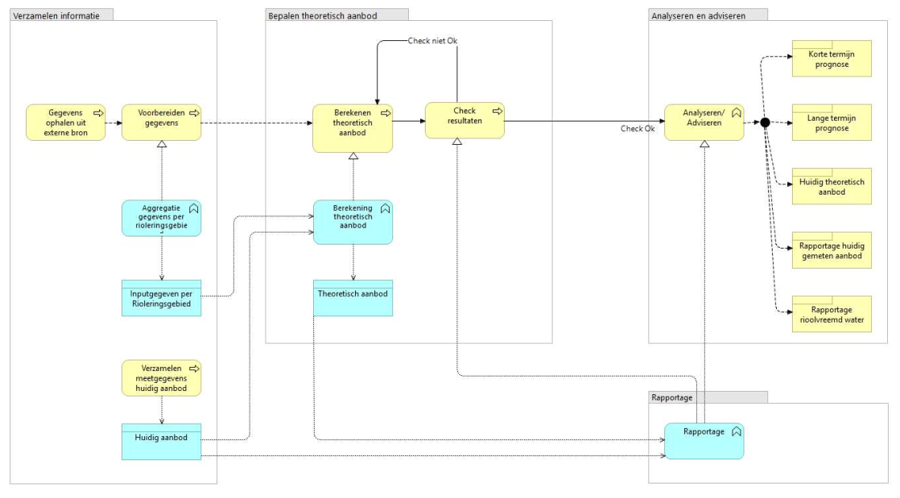

# GWSW Kentallen

**Beschrijving van afvoerrelaties en gebiedskenmerken per rioleringsgebied**

Versie 0.1.3

Versietabel

- Versie 0.1.3 bijgewerkt nav overleg dd 4 december 2020, bedoeld voor beperkte publicatie
- Versie 0.1.2 tweede opzet, harmoniseren met GWSW model
- Versie 0.1.1 eerste opzet van GWSW Kentallen + uitkomsten overleg MV en JN
- Versie 0.1 eerste opzet van GWSW Kentallen

Momenteel zijn we (Stichting RIONED met een kleine werkgroep) bezig met de ontwikkeling van GWSW Kentallen. Er is een vroege conceptversie van het model beschikbaar. Deze staat hieronder beschreven. Voorliggende documentatie is geschreven met als doel toekomstige gebruikers te informeren over deze ontwikkeling: Wat is 'GWSW Kentallen' en welke stappen worden gezet in de ontwikkeling daarvan. De ontwikkeling wordt ondersteund door een aantal praktijktoetsen (*"proof of concepts"*) en tussentijdse evaluaties. Een roadmap zal later worden toegevoegd aan deze pagina. Hierin zal ook het beoogde communicatie- en informatietraject worden opgenomen.

Gelieve de inhoudsopgave als leeswijzer te beschouwen.

# Inleiding

Afvoerrelaties en kentallen van rioolstelsels en rioleringsgebieden worden onder andere gebruikt voor het opstellen van afvalwaterprognoses. Om deze informatie bij elkaar te krijgen, is vaak een forse inspanning nodig. Door gebruik te maken van gestandaardiseerde open data en eenduidige terminologie is het mogelijk om op een efficiënte en vergelijkbare wijze de afvoerrelaties en gebiedskenmerken te beschrijven. Dit vereenvoudigt en verbetert het opstellen van afvalwaterprognoses.

De afkorting GWSW staat voor *GegevensWoordenboek Stedelijk Water*, de open standaard waaraan Stichting RIONED met alle relevante partijen werkt. Daarmee worden komende jaren alle objecten en de gegevens van die objecten, hun onderlinge relaties, en de beheeractiviteiten aan de riolering eenduidig gedefinieerd en vastgelegd ten behoeve van soepele gegevensuitwisseling en beter beheer. Meer informatie daarover vindt u via [www.riool.net/gwsw](https://www.riool.net/gwsw).

Een deel van deze afvoerrelaties en kentallen kunnen al worden beschreven met het GWSW. In het GWSW ontbreekt echter de schematisering van onderling aansluitende rioleringsgebieden en de verbinding met de RWZI. Vanuit de Community of Practice ‘Afvalwaterprognoses’ van de waterschappen is aan Stichting RIONED gevraagd om het GWSW geschikt te maken om als bron te dienen voor het doorrekenen van afvoerscenario’s in de afvalwaterketen. Dit wordt beschreven in GWSW-Kentallen.

De algemene beschrijving van het GWSW model vindt u op [data.gwsw.nl](https://data.gwsw.nl/). De datamodellen GWSW-Basis (operationeel beheer), GWSW-Rib (inspectie en reiniging van leidingen, putten en kolken) en GWSW-Hyd (hydraulische modellering) zijn al eerder vastgestelde onderdelen van het GWSW. De tools rondom GWSW vindt u op [apps.gwsw.nl](https://apps.gwsw.nl) .

# Het GWSW en afvalwaterprognoses

## GWSW Architectuur

In de volgende figuur zijn de bestaande gegevensstromen en gereedschappen rond het GWSW weergegeven, die zijn in veel gevallen ook relevant voor het doorrekenen van afvoerscenario’s.

*GWSW Architectuur*

**Gegevens** worden uitgewisseld met het GWSW-OroX, een uitwisselprotocol volgens de wereldwijd toegepaste linked data taal RDF/RDFS/OWL-2/Turtle. Het GWSW.orox is de uitwisselingsvorm voor alle disciplines zoals aanleg, vervangen, inspecties en dus ook hydraulische berekeningen. Een GWSW.orox bestand wordt vanuit de beheersystemen aangemaakt en zal alle relevante projectgegevens bevatten, bij hydraulische berekeningen dus de relevante gegevens uit het studiegebied. Het GWSW.orox bestand kan door beheersystemen en andere software weer ingelezen worden en op die manier de resultaten van uitgevoerde inspecties of berekeningen terugvoeren.

De volgende **gereedschappen** spelen een rol:

1. Beheersystemen: Deze applicaties hebben import- en exportfuncties voor de uitwisseling van de projectgegevens conform OroX.
2. GWSW-Server: Deze applicatieserver (in beheer bij Stichting RIONED) verzorgt de import van GWSW.orox bestanden en plaatst die in zogenaamde GWSW-datasets. De GWSW-datasets dienen als neutrale gegevensbron voor allerlei toepassingen. De GWSW-server verzorgt dan ook de export en import van hydx-bestanden voor hydraulische berekeningen met als basis de GWSW-datasets. Daarnaast valideert de GWSW-server zowel de aangeleverde projectgegevens als de terug geleverde projectresultaten. Deze validatie borgt de basiskwaliteit van de datasets. De validatie is een nulmeting waarbij alleen op de in het GWSW opgenomen kwaliteitseisen (zoals objecttypering, minimum en maximum waarde, verplichte kenmerken) getoetst wordt.

## Proces afvalwaterprognoses

### Business case Gezamenlijke Prognoses in de Afvalwaterketen

Het verzamelen van gegevens voor het doen van afvalwaterprognoses is een complex proces. Het Waterschapshuis heeft dit in een business case uitgewerkt.

*Gezamenlijke prognoses in de afvalwaterketen*  

### Rol GWSW in het proces

Zoals beschreven heeft het GWSW als doel de gegevens voor stedelijk waterbeheer optimaal te laten doorstromen. Nu al worden door gemeenten en waterschappen de gegevens van rioolstelsels en afvoersystemen op de GWSW Server gepubliceerd. De rioleringsbeheersystemen van gemeenten en de DAMO-AWK database van waterschappen zijn daarvoor een belangrijke bron.

Belangrijke GWSW concepten voor het uitwerken van afvoerscenario's en het maken van afvalwaterprognoses zijn *Stelsel* en *Gebied*.

*Stelsels en gebieden in het GWSW*  

Het datamodel GWSW Kentallen ondersteunt bij het doorrekenen van afvoerscenario's. Dat geeft inzicht in de belasting van de zuiveringsinstallatie en is belangrijk voor het optimaliseren van de afvalwaterketen.

Waterschappen en adviesbureaus hebben diverse applicaties in gebruik voor het doorrekenen van afvoerscenario's. In alle gevallen wordt er een schema van de afvalwaterstromen binnen de zuiveringskring uitgewerkt en doorgerekend.

*Voorbeeld blokkenschema zuiveringskring*  

# Datamodel GWSW Kentallen

## Reikwijdte

Het datamodel GWSW Kentallen bevat alle concepten die noodzakelijk zijn voor het berekenen van afvoerscenario's binnen de afvalwaterketen. Belangrijke onderdelen zijn:

- De definitie van het rioleringsnetwerk conform de module GWSW Hyd, gebruikt voor netwerkberekeningen van vrijverval rioolstelsels (al opgenomen in het GWSW).
- Een - vooralsnog beperkte - beschrijving van de gemeentelijke en waterschapsactiviteiten voor het optimaliseren van de afvalwaterketen (al eerder - in concept - opgenomen in het GWSW)
- De definitie van het afvoernetwerk, de schematisering van onderling aansluitende gebieden/stelsels en de verbinding met de RWZI (is nieuw in het GWSW - module GWSW Kentallen).

Voor de details van het datamodel GWSW Kentallen, zie [data.gwsw.nl/Kentallen](https://data.gwsw.nl/Kentallen)

## Afvoernetwerk

Zie [data.gwsw.nl/Kentallen/Afvoernetwerk](https://data.gwsw.nl/Kentallen/Afvoernetwerk)

Binnen een zuiveringskring vormen rioleringsgebieden, rioolstelsels (vrijverval en mechanisch) en de zuivering samen met verschillende type leidingen een afvoernetwerk. Dit netwerk bestaat uit verbindingen (afvoerrelaties) en knooppunten (afvoerpunten). In GWSW Kentallen wordt dit netwerk topologisch geschematiseerd. Dat betekent dat het netwerk zonder geografische kenmerken, maar met kenmerken die relevant en specifiek zijn voor de afvoerrelatie of het afvoerpunt. Dit maakt het mogelijk om op een schematische manier onderscheid te maken tussen kenmerken die onderscheiden moeten worden ten behoeve van het doel (in dit geval het doorrekenen van afvoerscenario's).

*Afvoernetwerk in GWSW Kentallen*

## Afvoerrelatie

Zie [data.gwsw.nl/Kentallen/Afvoerrelatie](https://data.gwsw.nl/Kentallen/Afvoerrelatie)

### Identiteit

De verbinding tussen het ene afvoerpunt en het andere afvoerpunt wordt een afvoerrelatie genoemd. Elke afvoerrelatie is van het type gwsw:Afvoerrelatie, een subtype van gwsw:Verbinding. Een afvoerrelatie kan een naam hebben (geldt voor elk object in het GWSW).

### Van en naar

In de afvoerrelatie staat gedefinieerd van welk knooppunt naar welk knooppunt de afvoer plaatsvindt. Die knooppunten zijn altijd van het type gwsw:Afvoerpunt (een subtype van gwsw:Knooppunt).

Subtypes van gwsw:Afvoerrelatie definiëren op welke wijze de afvoer plaatsvindt. Dit kan via een vrijverval transportleiding of (meestal) via een persleiding zijn.

### Debiet

Bij de afvoerrelatie wordt ook gedefinieerd wat het kenmerken zijn van die afvoerrelatie. Denk hierbij aan verschillende vormen van debieten.

## Afvoerpunt  

Zie [data.gwsw.nl/Kentallen/Afvoerpunt](https://data.gwsw.nl/Kentallen/Afvoerpunt)

Een afvoerpunt is de topologische vertaling van rioolstelsels (vrijverval en mechanisch), rioleringsgebieden en de zuivering. De kentallen van een stelsel, gebied of RWZI worden gekoppeld aan het afvoerpunt. Afvoerrelaties verbinden afvoerpunten. Het GWSW datamodel is zo ingericht dat het afvoerpunt is gerelateerd aan een fysieke afvoerconstructie (zoals een rioolgemaal, stuwput, leiding) van het betreffende stelsel of gebied. In de meeste gevallen zal een rioolgemaal het afvoerpunt van een stelsel of gebied zijn.

Een afvoerpunt is topologisch gekoppeld (met de relatie gwsw:hasConnection) aan een gwsw:Leiding (het begin- of eindpunt) of een gwsw:Doorlaat, gwsw:Pomp of gwsw:Wand (het begin- of eindpunt).
Daarnaast wordt een afvoerpunt toegekend (met de relatie gwsw:isPartOf) aan een gwsw:Stelsel (vrijverval of mechanisch), een gwsw:Gebied (dat meerdere stelsels kan bevatten) of een gwsw:Rioolgemaal.

### Vrijverval rioolstelsel

 Zie [data.gwsw.nl/Kentallen/AfvoerpuntVrijvervalStelsel](https://data.gwsw.nl/Kentallen/AfvoerpuntVrijvervalStelsel)

*Stelseltype*

In het GWSW-datamodel zijn alle types vrijverval rioolstelsel beschreven en van een naam voorzien.
Het stelseltype van een rioleringsgebied bepaalt welke kentallen er relevant zijn om mee te nemen. Een stelsel kan zijn van het type gemengd, DWA, gescheiden HWA en verbeterd gescheiden HWA.

Bij een gemengd stelsel gaat de hemelwater afvoer en droogweer afvoer via één set aan leidingen naar het gemaal. Een een gescheiden of verbeterd gescheiden stelsel bestaat uit een separate set van HWA-leidingen en/of DWA-leidingen. Bij een verbeterd gescheiden HWA is er aanvullend een pompovercapaciteit en berging beschikbaar.

*Hemelwaterafvoer (HWA)*

Het volume water dat in de afvalwaterketen terecht komt, wordt grotendeels bepaald door het afvoerend oppervlak en de hoeveelheid neerslag. De hemelwater afvoer wordt in GWSW Kentallen opgegeven als hoeveelheid afvoerend oppervlak (in m2).

*Droogweer afvoer (DWA)*

Droogweer afvoer (DWA, in m3/uur) wordt bepaald door de hoeveelheid huishoudelijk afvalwater, bedrijfsafvalwater en afvalwater van recreatie. Het huishoudelijk afvalwater wordt gedefinieerd met inwoner equivalenten (i.e.).

Het bedrijfsafvalwater en afvalwater van recreatie wordt gedefinieerd met vervuilingseenheden (v.e.).

*Pompovercapaciteit*

Pompovercapaciteit (poc) is dat deel van de pompcapaciteit dat na aftrek van DWA en injecties overblijft om ingezameld hemelwater af te voeren. De pompovercapaciteit wordt gedefinieerd in m3/uur en geprojecteerd op afvoerend oppervlak (in mm/uur). Pompovercapaciteit is beschikbaar bij het stelseltype gemengd en verbeterd gescheiden HWA.

*Berging*

Stelselberging is de hoeveelheid water die in een stelsel kan worden geborgen. Ook kan de berging in een eventuele randvoorziening worden gedefinieerd.

Berging wordt gedefinieerd in m3 en geprojecteerd op afvoerend oppervlak (in mm). Berging is beschikbaar bij het stelseltype gemengd en verbeterd gescheiden HWA.

### Mechanisch rioolstelsel, (doorvoer)rioolgemalen en RWZI

Zie [data.gwsw.nl/Kentallen/AfvoerpuntMechanischStelsel](https://data.gwsw.nl/Kentallen/AfvoerpuntMechanischStelsel)

Zie [data.gwsw.nl/Kentallen/AfvoerpuntRioolgemaal](https://data.gwsw.nl/Kentallen/AfvoerpuntRioolgemaal)

Zie [data.gwsw.nl/Kentallen/Afleveringspunt](https://data.gwsw.nl/Kentallen/Afleveringspunt)

In het GWSW-datamodel zijn alle types mechanisch rioolstelsel, (doorvoer)rioolgemaal en RWZI beschreven, inclusief naamgeving. Bij de afvoerpunten mechanisch rioolstelsel, rioolgemaal en RWZI zijn nog geen kentallen opgenomen.
Een afvoerpunt bij een rioolgemaal zal alleen gebruikt worden om een doorvoergemaal te beschrijven, de andere rioolgemalen worden gespecificeerd als afvoerpunt bij een stelsel of gebied.

### Rioleringsgebied

Zie [data.gwsw.nl/Kentallen/AfvoerpuntGebied](https://data.gwsw.nl/Kentallen/AfvoerpuntGebied)

Vrijverval en mechanische rioolstelsels kunnen geclusterd worden in een rioleringsgebied. Een rioleringsgebied heeft dan de gecombineerde kentallen van de stelsels. Binnen het rioleringsgebied zijn dan één of meerdere afvoerpunten beschreven met de gebundelde kenmerken.

Een rioleringsgebied kan allerlei soorten stelsel bevatten, een gwsw:AfvoerpuntGebied bevat daarom de volledige set aan kentallen.

# Toepassen van GWSW Kentallen

De ontwikkeling van het definitieve datamodel voor GWSW Kentallen wordt ondersteund door een aantal praktijktoetsen ("proof of concept"). Daarin onderscheiden we de volgende stappen:

## Stap 1: Definiëren afvoernetwerk van een zuiveringskring

Tussen waterschap en gemeentes zijn afspraken nodig over de opbouw van het afvoernetwerk:

- Welke rioleringsgebieden (clusters van stelsels) onderscheiden we en wat zijn daarvan de afvoerpunten?
- Welke stelsels (mechanisch en vrijverval) worden met een apart afvoerpunt beschreven?
- Welke overige afvoerpunten (afleveringspunt, rioolgemalen) onderscheiden we?
- Welke fysieke afvoerconstructie (zoals een rioolgemaal, stuwput, leiding) is gerelateerd aan het afvoerpunt?
- Wat zijn de resulterende afvoerrelaties (verbindingen van de afvoerpunten)?

## Stap 2: Bepalen van de benodigde velden en bronnen om die velden te vullen

Nadat het afvoernetwerk is gedefinieerd moet worden bepaald:

- Welke kenmerken er voor de verschillende type afvoerpunten en afvoerrelaties minimaal (en welke optioneel) beschikbaar moeten zijn voor het doorrekenen van afvoerscenario's?
- Op welke wijze die kenmerken het beste kunnen worden beschreven in GWSW Kentallen? (Dit zijn de uiteindelijke velden in GWSW kentallen)?
- Welke brongegevens daarvoor gebruikt kunnen worden?

Als bronnen kan gedacht worden aan:

**Beheersystemen**

- Afvoerend oppervlak
- Afgekoppeld oppervlak
- Aantal woningen / Aantal inwoners (vaak is het aantal woningen per put/leiding geregistreerd)
- Aantal v.e. bedrijven
- Aantal v.e. recreatie
- Stelselberging (in m3 en mm)
- Berging in randvoorzieningen (in m3 en mm)
- Verloren berging (in m3)
- Debiet DWA-situatie en DWA+HWA-situatie (in m3/uur)

En daarnaast, conform GWSW-Basis

- Eigenschappen (type, naam, geometrie) van stelsels en gebieden
- Eigenschappen (type, naam, geometrie) van afvoerpunten
- Eigenschappen (type, naam) van afvoerrelaties (de geometrie wordt afgeleid van de afvoerpunten)

**GIS en rapportages (gebaseerd op bijvoorbeeld hydrodynamische rekenmodellen voor vrijverval rioolstelsels)**

- Afvoerend oppervlak
- Afgekoppeld oppervlak
- Berging (in m3 en mm)
- Verloren berging als gevolg van slechte afstroming (in m3 en mm)
- Berging in randvoorzieningen (in m3 en mm)
- Pompovercapaciteit (in m3/uur en mm/h)
- Maatgevend niveau voor stelselberging (in m NAP)

Na Stap 2 zal er een tussentijdse evaluatie worden gehouden om te komen tot een nieuwe conceptversie.

## Stap 3: Vullen datasets conform GWSW Kentallen

Tijdens de *Proof of Concept* zullen aanvankelijk de velden van de database handmatig gevuld worden. Daarna is het de bedoeling dat de velden grotendeels automatisch gevuld worden.

Na Stap 3 zal er een tussentijdse evaluatie worden gehouden om te komen tot een nieuwe conceptversie

## Stap 4: Doorrekenen afvoerscenario's

De laatste stap van de *Proof of Concept* is het toepassen van GWSW Kentallen in de praktijk, met andere woorden: Kunnen we GWSW Kentallen gebruiken om afvoerscenario's door te rekenen.

Waterschappen in Nederland hebben diverse applicaties in gebruik voor het doorrekenen van afvoerscenario's. Die applicaties kunnen afgestemd worden op het gebruik van GWSW-datasets. Stichting RIONED ontwikkelt hiertoe standaard queries om de relevante gegevens van het afvoernetwerk op te vragen.

Hierna volgen enkele voorbeelden van de gebruikte applicaties.

**GeoDyn**

Functionaliteiten:

- Presentatie via GIS en Webviewer
- Vergelijking drinkwaterverbruik en DWA
- Afleiden rioolvreemd water
- …

*GeoDyn - visualisatie drinkwaterverbruik versus DWA*

**FlowTraffic**

Op basis van:

- GeoWeb: Visueel en geografisch
- WANDA: Software voor hydraulische berekeningen aan persleidingsystemen
- API

Na Stap 4 volgt een evaluatie en zal de eerste definitieve release van het datamodel beschikbaar komen.

# Openstaande zaken

Het model van GWSW Kentallen is in een premature conceptversie opgesteld. Er zijn in de conceptversie ongetwijfeld zaken die ontbreken, anders zouden moeten worden opgenomen of waarin verschillende meningen van toepassing kunnen zijn. Een aantal van die zaken zijn al in beeld. Hieronder een overzicht. Het is de bedoeling dat met de verschillende stappen van de *Proof of Concepts* hierover informatie wordt opgehaald.

## Varianten/scenario’s

Als gebruiker zou je misschien wel verschillende afvoerscenario’s naast elkaar op de GWSW server willen opslaan. Mogelijk dat verschillende naamgeving van datasets dit zou kunnen faciliteren, zoals:

- Huidige praktijksituatie
- Huidige normatieve situatie (op basis van afspraken uit het afvalwaterakkoord)
- Toekomstige situatie (werkelijk/normatief/jaartal)

Welke varianten zouden de gebruikers willen hebben? Hoe ver ga je met het opslaan van de gegevens in de brondatabase? Het enige verschil in werkelijke en normatieve situatie is de POC. Gegevens zoals stelseltype,  inwoners, woningen, afvoer bedrijven / recreatie en verh oppervlak blijven gelijk. Misschien handiger om alleen deze uit te wisselen? De rest is te berekenen. Voor de toekomst veranderen de bovenstaande gegevens wel. Dus meerdere toekomst scenario's zijn zeker nodig.

## Redundantie m3/uur en mm/uur

Berging, berging in randvoorziening en pompovercapaciteit worden beschreven in m3/uur en via een projectie op verhard oppervlak ook in mm/uur. In principe bevat het dus redundante informatie. Wat is hier in wenselijk vanuit de gebruikers?

## Drempelhoogte die bepalend is voor de berging

Overstortdrempels zijn niet altijd maatgevend voor de omvang van de stelselberging. In de beschrijving van de huidige versie van het model wordt daarom gesproken over Maatgevend niveau voor stelselberging (in m NAP).
Dekt dit beter de lading? Is er uberhaupt een niveau nodig om mee te geven? Of moet dit juist uitgebreid worden met een koppeling aan een object die de 'maatgevend'-heid bepaald?

## Pompovercapaciteit

Welke smaken van pompovercapaciteiten (poc) willen de gebruikers kunnen toepassen? Naast de werkelijke poc ook de norm poc opnemen (0,7 mm/uur voor gemengde stelsels en 0,3 mm/uur voor verbeterd gescheiden stelsels) of mogelijk zelfs afspraken over aangepaste poc's?

## Kenmerken afvoerrelaties

Welke kenmerken van de afvoerrelaties moeten in GWSW kentallen kunnen worden vastgelegd? Of zijn daarin de kenmerken van rioolgemalen, die als object gekoppeld worden aan een afvoerpunt, voldoende? Welke varianten van de gemaalcapaciteit zou dan kunnen moeten worden opgegeven? Geïnstalleerd, ontwerp, huidig, maar wellicht ook andere smaken?

## Onderscheid in bedrijventerreinen en woongebieden

Sommige waterschappen passen een methodiek toe waarin de aanname 150 m2/woning wordt gebruikt. Hoe zou dit het beste in het model opgenomen kunnen worden? En zijn er nog andere variaties mogelijk/bekend? 

## Afgekoppeld oppervlak

Hoe zou er om moeten worden gegaan met het afgekoppelde oppervlak binnen een gemengd of verbeterd gescheiden stelsel? 
Ter illustratie: Bij een gemengd stelsel zijn de kolken van één straat aangesloten op een gescheiden HWA-leiding die afvoert naar een wadi. Feitelijk zijn dit twee stelsels (1 gemengd en 1 gescheiden HWA). In de praktijk zullen die opgenomen worden als één rioleringsgebied, waarin de kentallen van het gemengde stelsel worden opgenomen als kentallen van het afvoerpunt. Maar waar het oppervlak dat van het gemengd is afgekoppeld, en is aangesloten op het gescheiden HWA ook een plaats moet hebben.

## Sommatie van verschillende afvoerpunten

Zou het wenselijk zijn om meerdere stelsels en dus meerdere afvoerpunten bij elkaar op te tellen? Of hoort dit eigenlijk al vanaf het begin als één rioleringsgebied met één afvoerpunt gedefinieerd te zijn?
